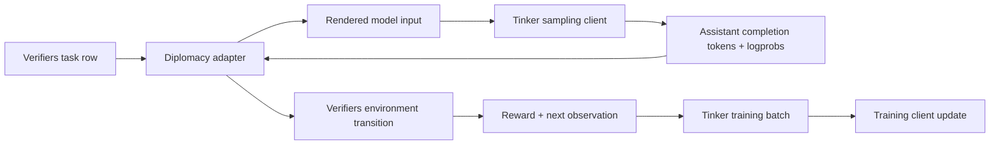
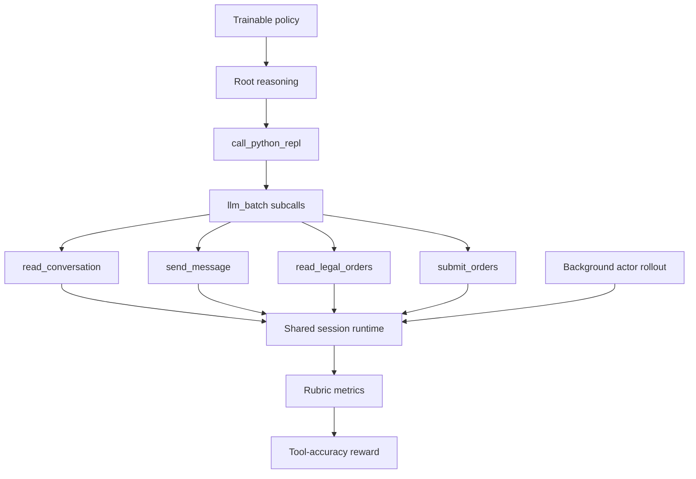
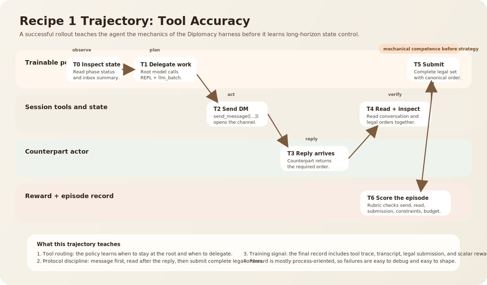
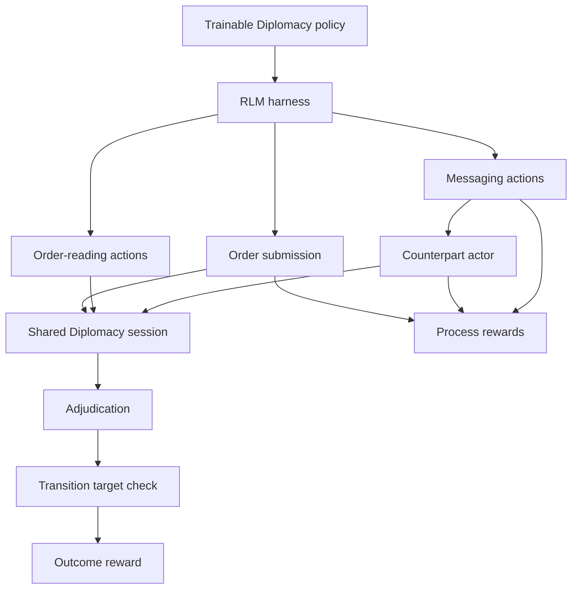
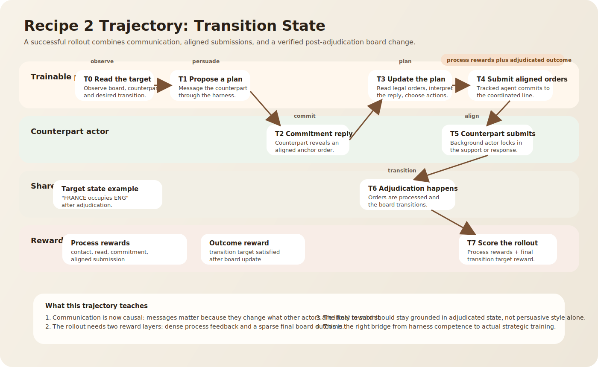
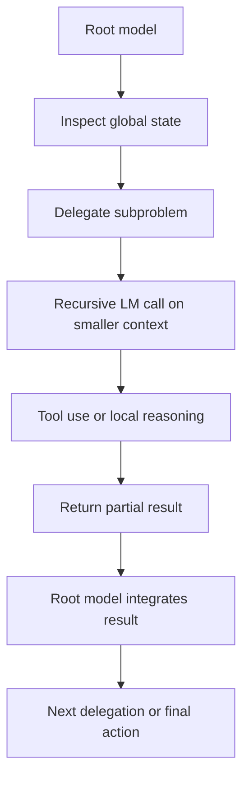
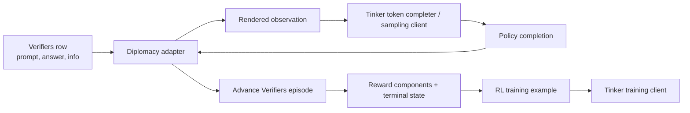

# Sedona Marketplace Agent Training Guide

This guide is a builder handbook for research engineers who want to train a Diplomacy agent end to end for Sedona Marketplace.

Sedona is an opinionated AI research lab focused on open-source LLMs and moving the Pareto frontier of capabilities. Sedona Marketplace is the first product: each month, Sedona releases a new agent evaluation and opens a two-week competition. Builders train agents against the evaluation, but the final winner is decided by the market's belief about which developer and agent pair is strongest overall for that objective.

## Table of Contents

- [Introduction](#introduction)
- [Why Sedona Marketplace Uses RL Environments](#why-sedona-marketplace-uses-rl-environments)
- [1. End-to-End Training Pipeline](#1-end-to-end-training-pipeline)
- [2. Quick Start: RL Environment Recipes](#2-quick-start-rl-environment-recipes)
  - [Recipe 1: Base Environment - Tool Calling](#recipe-1-base-environment---tool-calling)
  - [Recipe 2: Transition States - Persuasion & Multi-Stage Rewards](#recipe-2-transition-states---persuasion--multi-stage-rewards)
- [3. Appendix](#3-appendix)
  - [A. RLM - In Depth](#a-rlm---in-depth)
  - [B. Anatomy of an RL Environment + Glossary](#b-anatomy-of-an-rl-environment--glossary)
  - [C. Tinker API - Training Guide](#c-tinker-api---training-guide)
  - [D. Verifiers + Tinker for Diplomacy](#d-verifiers--tinker-for-diplomacy)

## Introduction

If you want to train a strong agent, the model is only one part of the story. The environment determines what the agent sees, what it can do, how it receives feedback, and what behaviors get reinforced.

For Sedona Marketplace, that is the point. The monthly evaluation is not just a scorecard. It is the training ground. If you can define a clean task, expose the right tools, reward the right behaviors, and avoid reward hacking, you can train a useful agent. If you get those pieces wrong, a stronger base model will still learn the wrong thing.

This repo is already a good teaching substrate because it contains two distinct Diplomacy environments:

- a tool-accuracy environment that isolates mechanical harness use
- a full-press environment that requires coordination and checks an actual post-adjudication outcome

That progression is exactly how you should teach and build an end-to-end training stack.

## Why Sedona Marketplace Uses RL Environments

Sedona Marketplace works best when the evaluation is not just something agents are measured against at the very end. It should be something agents can learn against repeatedly.

That is why RL environments matter:

- they turn a vague product goal into a repeatable task
- they make progress observable
- they attach rewards to behaviors you actually want
- they let you train and evaluate against the same interface

In Diplomacy, the evaluation objective is not simply "write good text." The agent must:

- inspect the board state
- reason about legal actions
- communicate through the available channels
- coordinate with other agents
- submit legal orders
- produce the board transition that the task cares about

That is exactly the kind of problem where an RL environment is more useful than a static supervised dataset.

> **Recommended training architecture**
>
> Treat those environments as the canonical task harness. Keep the environment logic in Verifiers, and train the policy with Tinker through a thin adapter layer.

## 1. End-to-End Training Pipeline

The clean mental model is:

1. Define the task.
2. Wrap the task in an environment.
3. Roll out the current policy inside that environment.
4. Grade the resulting trajectory.
5. Update the policy to increase high-reward behavior.
6. Re-run evaluation on held-out seeds and submit.


### Step 1: Define the task

Each generated row includes:

- the tracked power
- the relevant counterpart powers
- the initial board state
- the required interactions
- order constraints or transition targets
- actor prompts for hidden counterpart policies
- deterministic orders for unrelated powers when needed

That is the right level of abstraction. The task row should define the episode without hard-coding policy behavior.

### Step 2: Build the environment

The environment has to do more than print a prompt. It must own:

- state initialization
- observations
- available actions or tools
- hidden environment dynamics
- termination
- scoring

The backend creates a shared session runtime containing:

- a `diplomacy.Game`
- a temporary SQLite-backed chatroom
- the tracked power
- relevant powers
- current submissions
- deterministic submissions for non-relevant powers

It then exposes a split tool interface:

- **root tools**: `read_phase_status`, `read_inbox_notifications`
- **sub-LLM tools**: `read_conversation`, `send_message`, `read_legal_orders`, `submit_orders`

That split matters because the root model is encouraged to reason at a higher level, while delegated subcalls do focused tool work.

### Step 3: Collect rollouts

During a rollout, the policy is not judged on a single answer string. It is judged on the whole trajectory:

- what it read
- what it messaged
- which tools it called
- whether it exceeded the invalid-tool-call budget
- whether it submitted complete legal orders
- whether the target board transition happened

That is why RL environments are powerful: they let you score behavior, not just output.

### Step 4: Grade the trajectory

The reward function is where the environment becomes useful or useless.

In this repo, grading is implemented as Verifiers rubric functions:

- tool-accuracy reward is a weighted combination of protocol and submission metrics
- full-press reward is gated by protocol correctness and then decided by whether the desired transition target is satisfied

This is already the correct shape for RL:

- process signals where you need dense feedback
- outcome signals where you care about the final objective
- hard gates for obviously invalid behavior

### Step 5: Train the policy

This repo does not yet include a native trainer. The recommended setup is:

- keep Verifiers as the environment and grading harness
- use Tinker as the policy training system
- add a small adapter that turns a Verifiers episode into a Tinker RL sample

That adapter should own five responsibilities:

1. Initialize an episode from a Verifiers task row.
2. Render the current observation into the model input expected by the policy.
3. Execute the sampled assistant completion against the environment.
4. Return reward and next observation.
5. Preserve token-level trajectory information for training.



### Step 6: Evaluate and submit

A useful rule is: train on one loop, evaluate on another, but keep the environment family consistent.

For Sedona Marketplace, that means:

- train against the same class of environment
- evaluate on held-out seeds or held-out scenario generators
- keep the counterpart actor setup stable enough to compare agents fairly

In practice, your evaluation harness should look much closer to this repo's rollout script than to your trainer.

## 2. Quick Start: RL Environment Recipes

The two recipes are not separate product ideas. They are two stages in the same training story.

- Recipe 1 teaches the policy how to use the harness correctly.
- Recipe 2 teaches the policy how to use the harness to change the world.

### Recipe 1: Base Environment - Tool Calling

Recipe 1 is the smallest useful training environment. The policy does not need to solve long-horizon transition reasoning yet. It just needs to learn how to operate the Diplomacy harness correctly.

#### What the agent is learning

The trainable policy must:

- inspect phase state
- read legal orders
- DM the correct counterpart
- wait for and read the reply
- submit a complete legal order set
- include the exact required canonical order
- stay within the invalid-tool-call budget

This is not "toy" work. If the policy cannot do this reliably, it will fail in any more ambitious environment later.



#### Example trajectory

The architecture diagram tells you which pieces exist. The trajectory diagram below shows what one successful episode actually looks like over time.



In Recipe 1, the important thing is the sequencing: inspect state, contact the counterpart, wait for the reply, read the reply, then submit a complete legal order set with the required canonical order.

#### Why this is the correct first recipe

This environment isolates mechanical correctness:

- the counterpart is simple
- the board target is local
- the reward is legible
- the agent can fail in obvious, debuggable ways

That makes it ideal for:

- validating the harness
- checking that your prompt and action interface are sensible
- training away brittle tool-use mistakes before they pollute a longer-horizon policy

#### How Verifiers expresses the environment

The important design choice is that the environment is not encoded as a single prompt template. It is encoded as:

- a dataset row
- a stateful backend
- tool semantics
- a rubric

That is the Verifiers mental model you should teach:

- **dataset row** defines the episode
- **runtime** defines the world
- **tools** define the action surface
- **rubric** defines what success means

The current tool-accuracy recipe uses all four.

#### How the RLM harness fits in

The agent is not trained to emit raw internal tool calls from one flat prompt. Instead, it is trained inside an RLM-style harness:

- the root model can inspect global state with root tools
- the root model can call `call_python_repl`
- the REPL can invoke `llm_batch`
- those subcalls use the narrower tool surface to perform focused work

That is the right way to think about the action space:

- the policy's "action" is not only text
- the policy's action is text plus delegated tool use
- the harness turns recursive language-model calls into a structured control interface

#### Reward shape for Recipe 1

Recipe 1 should remain mostly process-oriented:

- reward correct contact behavior
- reward correct read-after-reply behavior
- reward legal complete submission
- reward exact canonical order inclusion
- penalize rejected tool calls by budget

There is no need to add transition-state rewards here. The point is to teach the policy the mechanics of the harness.

#### How to train Recipe 1 with Tinker

The recommended loop is:

1. Sample a tool-accuracy task row from Verifiers.
2. Create a session runtime.
3. Render the current root observation for the trainable policy.
4. Sample a completion with Tinker.
5. Advance the Verifiers episode.
6. When the episode ends, export:
   - token-level completion data
   - reward
   - any process-level annotations you want to keep
7. Optimize the policy in Tinker.

Illustrative pseudocode:

```python
# Illustrative pseudocode, not a drop-in file from this repo.

service = tinker.ServiceClient()
training_client = service.create_lora_training_client(
    base_model="your-base-model",
    trainable_rank=64,
)
sampling_client = training_client.save_weights_and_get_sampling_client(
    name="diplomacy-bootstrap"
)

for update in range(num_updates):
    task_rows = sample_verifiers_rows(environment="tool_accuracy", batch_size=batch_size)
    rl_batch = []

    for row in task_rows:
        episode = diplomacy_adapter.start_episode(row)
        while not episode.done:
            completion = sampling_client.sample(episode.model_input)
            episode = diplomacy_adapter.step(episode, completion)
        rl_batch.append(diplomacy_adapter.to_training_example(episode))

    training_client.forward_backward(rl_batch)
    training_client.optim_step()
```

> **Recommended training architecture**
>
> Start by freezing the background counterpart policies and only training the tracked policy. The environment is already multi-agent, but your first training target should be single-policy competence inside a stable world.

#### What "good" looks like

A good Recipe 1 policy:

- almost never makes rejected tool calls
- reliably waits for the counterpart reply before claiming the read reward
- submits complete legal orders
- includes the required canonical order without brittle prompt-specific hacks

If the policy cannot do that, do not move on to Recipe 2.

### Recipe 2: Transition States - Persuasion & Multi-Stage Rewards

Recipe 2 extends the environment from "use the harness correctly" to "use the harness to achieve a board objective through another agent."

The current repo already contains the right skeleton for this stage: the `full_press` environment.

#### What changes from Recipe 1

Now the policy must:

- contact the counterpart
- read and interpret the reply
- infer whether the counterpart will align
- choose a submission that cooperates with the counterpart
- cause a target post-adjudication transition

This makes the task harder in exactly the right ways:

- the horizon is longer
- the final reward is sparser
- the quality of the messaging matters
- the environment now cares about real state transitions, not only local protocol satisfaction



#### Example trajectory

This is what the longer-horizon trajectory looks like when the policy uses the harness to create an actual board transition.



In Recipe 2, the trajectory has two layers of causality:

- messaging and commitment formation
- adjudication and board-state change

That is why the reward stack needs both process signals and a final outcome check.

#### Why this environment is the second recipe

This is where the policy stops learning "how to operate the shell" and starts learning "how to win through the shell."

Recipe 2 teaches:

- state transitions
- long-horizon dependency between messaging and outcome
- sparse objective rewards
- the need for multi-stage reward design

That is exactly the bridge from environment literacy to actual agent training.

#### Multi-stage reward composition

If you only reward the final transition target, learning will be slow and fragile. The better pattern is a layered reward stack:

| Stage | Signal | Why it exists |
| --- | --- | --- |
| Contact | Did the agent message the right counterpart? | Ensures the policy engages the coordination channel |
| Read | Did the agent read the reply after it arrived? | Prevents fake coordination |
| Commitment | Did the reply contain an aligned commitment or useful intent signal? | Encourages the policy to get actionable information |
| Submission | Did the tracked agent submit a complete legal order set consistent with the plan? | Prevents invalid but persuasive-looking play |
| Outcome | Did the desired transition happen after adjudication? | Keeps the true objective in the loop |

This is the core design lesson of Recipe 2:

- process rewards make credit assignment possible
- outcome rewards keep the policy aimed at the real objective
- gates stop obviously invalid trajectories from receiving partial credit they should not get

#### Persuasion framing

The natural next step after `full_press` is a persuasion environment.

Example framing:

- the tracked agent is Germany
- the counterpart is France
- the desired outcome is that France takes or supports a specific action
- the tracked agent must use messaging to produce that behavior

The environment should **not** reward persuasive-sounding language by itself. It should reward:

- correct contact
- evidence of alignment
- aligned legal submissions
- the target transition after adjudication

That keeps the reward grounded in verifiable state changes instead of style.

#### How to train Recipe 2 with Tinker

The training stack is the same as Recipe 1, but the sampling and reward handling change:

- keep grouped rollouts for the same task family so relative reward comparisons are meaningful
- preserve both process-level and outcome-level reward components
- checkpoint often and evaluate separately from the training batch

Recommended curriculum:

1. Train on Recipe 1 until tool use is stable.
2. Warm-start Recipe 2 from the Recipe 1 checkpoint.
3. Start with denser process rewards.
4. Gradually increase the weight on the final transition target.
5. Introduce persuasion variants only after the base transition-target environment is stable.

That curriculum matches the way the two environments are structured in this repo.

#### What "good" looks like

A good Recipe 2 policy:

- contacts the correct counterpart quickly
- reads replies at the right time
- avoids invalid tool calls
- submits legal orders that align with the intended plan
- converts alignment into an actual post-adjudication board transition

The more outcome-sensitive the environment becomes, the more important it is to guard against reward hacking. If the agent can get a good intermediate score without progressing the board objective, you have designed the wrong reward stack.

## 3. Appendix

### A. RLM - In Depth

At a conceptual level, an RLM is a harness around an LLM where the model can recursively invoke itself on transformed subcontexts rather than trying to solve everything in one giant context window.

That is the key idea from the RLM article:

- the root model works over a large problem
- the harness exposes tools for inspecting, slicing, and transforming context
- the model can recursively call itself on those smaller contexts
- the root model integrates the returned results

The value is not just "more context." The value is better control over what context is active at each point in reasoning.



#### How that maps onto this repo

This repo is not a verbatim implementation of the article's generic REPL-context setup. But it uses the same control pattern.

The root policy:

- reads global phase information
- calls `call_python_repl`
- uses `llm_batch` inside the REPL
- delegates narrower subproblems to sub-LLMs
- has those sub-LLMs use focused tools

That is why it is fair to describe the current harness as RLM-style:

- recursive language-model delegation is part of the action interface
- the agent is not reasoning in one flat completion
- the harness creates a distinction between planning and local execution

#### Why RLM-style harnesses are useful in Diplomacy

Diplomacy has exactly the properties that benefit from recursive delegation:

- multiple channels of information
- a mix of strategic and mechanical reasoning
- stateful tools
- need for asynchronous waiting and polling
- partial observations from messaging

The root model should handle the broad plan. Subcalls should handle narrow local tasks like:

- read the latest France conversation
- extract the counterpart's commitment
- inspect legal orders for one power
- submit the exact order set

That split usually improves both reliability and training signal.

### B. Anatomy of an RL Environment + Glossary

Below is the compact vocabulary you need to reason about the Diplomacy stack.

| Term | Meaning in general | Diplomacy example |
| --- | --- | --- |
| Observation | What the policy sees before acting | Board summary, inbox status, active prompt, conversation text |
| Action | What the policy can do | Call a tool, emit a message, submit orders |
| Tool action | A structured action executed by the environment | `send_message(...)`, `read_legal_orders()`, `submit_orders(...)` |
| State transition | How the world changes after an action | A message is inserted, submissions update, adjudication changes units |
| Trajectory | The full episode history | Prompt, tool trace, messages, submissions, reward, stop condition |
| Grader | Logic that computes reward | Verifiers rubric over protocol and board outcome |
| Outcome reward | Reward based on final success | Transition target satisfied after adjudication |
| Process reward | Reward based on intermediate behavior | Correct counterpart contacted; reply read after arrival |
| Multi-stage reward | Composition of several process and outcome rewards | Contact + read + alignment + legal submission + outcome |
| Sandbox | Isolated environment instance | Per-session runtime with its own temp DB and game state |
| Actor rollout | Background policy running inside the same world | Counterpart powers spawned by the async backend |
| Tracked agent | The trainable policy you care about | The main Diplomacy power in each task row |
| Transition target | Explicit board-state objective | "FRANCE occupies ENG" after adjudication |

The useful rule is simple: an RL environment is not just a prompt. It is prompt + tools + state + transitions + grader.

### C. Tinker API - Training Guide

Tinker is the training system in the recommended Sedona stack. Conceptually, it lets you keep the environment and reward logic in ordinary Python while outsourcing the expensive model-side training and sampling work.

#### What matters for this guide

You do not need the full Tinker API surface to train the Diplomacy agent. You need a few ideas:

- a training client to optimize the policy
- a sampling client to produce completions from current weights
- token-level trajectory information for RL
- LoRA-first fine-tuning instead of full model retraining

#### Why LoRA-first matters

For this use case, LoRA is the right default because:

- the environment will change often
- reward design will change often
- you want short iteration loops
- you will likely train multiple competition-specific variants

That makes small, fast, restartable policy updates more useful than heavyweight full fine-tuning.

#### Sampling vs training

Keep the distinction clear:

- **sampling client**: produces the current policy's outputs and token statistics
- **training client**: consumes RL batches and updates the trainable weights

For RL, this matters because reward alone is not enough. The trainer also needs token-level information from the policy that generated the trajectory.

#### How Tinker fits into the Diplomacy stack

In this setup:

- Verifiers owns the environment
- the Diplomacy backend owns the state transitions and grading logic
- Tinker owns policy optimization

That means the policy update loop should look like:

1. sample policy outputs
2. execute them inside the Verifiers environment
3. collect reward and trajectory data
4. convert those trajectories into a Tinker training batch
5. run an optimization step

> **Recommended training architecture**
>
> Keep Tinker policy-facing and keep Verifiers environment-facing. Do not try to rewrite the Diplomacy runtime inside Tinker.

#### Practical loop for this repo

Use a training loop with three cadences:

- **fast inner loop**: collect rollouts and optimize
- **medium loop**: checkpoint the adapter-trained policy
- **slow loop**: run held-out evaluation with the Verifiers environment family

That is enough to make the current repo trainable without changing its environment design.

### D. Verifiers + Tinker for Diplomacy

This section teaches the recommended bridge.

Important caveat: this guide is not claiming that Tinker ships a first-class Verifiers integration out of the box. The approach below is the recommended adapter pattern for this repo based on the documented Tinker and cookbook surfaces.

#### The adapter path

Use Verifiers as the task and evaluation harness. Use Tinker as the trainer. Connect them with a thin adapter.



#### Adapter responsibilities

The adapter should do exactly five things.

1. **Initialize from a Verifiers task row**
   - consume the row's `prompt`, `answer`, and `info`
   - create the shared Diplomacy session runtime
   - initialize any background actors that should be part of the environment

2. **Render prompt and observation for Tinker**
   - turn the current state into the model input for the trainable policy
   - include the system prompt, current task context, and any relevant observation text
   - keep the rendering stable across training and evaluation

3. **Execute the assistant completion against Verifiers**
   - feed the sampled policy output into the episode
   - allow the environment to run its tool calls and state transitions
   - stop only when the episode reaches terminal state or the next policy decision point

4. **Return reward and next observation**
   - surface both process and outcome rewards
   - return terminal state when the episode is done
   - preserve enough metadata to debug failures later

5. **Preserve trajectory information for RL**
   - sampled tokens
   - logprobs
   - per-step or per-episode reward
   - termination reason
   - grouping metadata if you train with grouped comparisons

#### Recommended adapter shape

Illustrative pseudocode:

```python
class DiplomacyEpisodeAdapter:
    def start_episode(self, row):
        state = make_verifiers_state(row)
        return Episode(
            row=row,
            state=state,
            model_input=self.render_observation(state),
            done=False,
            rewards=[],
        )

    def step(self, episode, completion):
        next_state = advance_verifiers_episode(episode.state, completion)
        reward = extract_reward(next_state)
        done = is_terminal(next_state)
        return Episode(
            row=episode.row,
            state=next_state,
            model_input=self.render_observation(next_state),
            done=done,
            rewards=[*episode.rewards, reward],
        )

    def to_training_example(self, episode):
        return build_tinker_rl_example(
            tokens=episode.state["sampled_tokens"],
            logprobs=episode.state["sampled_logprobs"],
            rewards=episode.rewards,
        )
```

The point is not the exact class names. The point is that the adapter should be thin and boring. The environment should stay in Verifiers. The trainer should stay in Tinker.

#### How the two recipes map into the adapter

For Recipe 1:

- reward export is mostly process-level
- counterpart policies can be kept simple and mostly fixed
- debugging focuses on tool traces and protocol failures

For Recipe 2:

- reward export becomes multi-stage
- counterpart policies matter more
- outcome checks happen after adjudication
- held-out evaluation becomes much more important

#### What not to do

Do not collapse all reward into a single late binary number if you want Recipe 2 to learn quickly.

Do not rebuild the Diplomacy runtime separately inside Tinker.

Do not train the tracked agent and all background actors at the same time until the single-policy curriculum is already stable. Otherwise you will not know whether failures come from the policy, the counterparts, or the reward function.

## Closing Notes

The most useful way to read this repo is:

- `tool_accuracy` teaches the harness
- `full_press` teaches the game
- the Tinker adapter teaches the training loop

Once those three pieces are in place, you have a full stack for training a Sedona Marketplace agent:

- a concrete task family
- a grounded environment
- a trainable action interface
- a reward function that can be optimized
- a clean evaluation path

If you are building for Diplomacy, that is the correct sequence. First teach the policy to operate the environment. Then teach it to move the world.
s